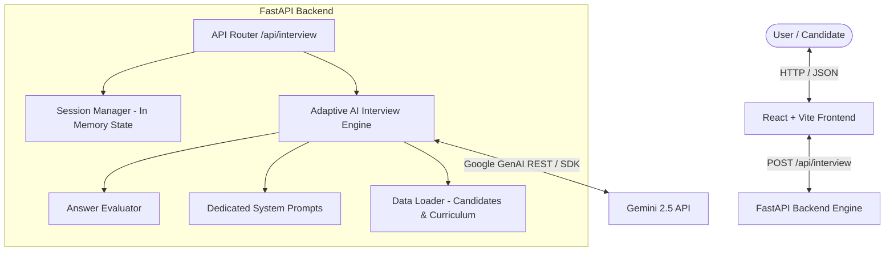

# The Interview Agent — Build the Interviewer, Not the Interview

> **AI Technical Interviewer Application**  
> Dynamic, adaptive, candidate-personalized technical interviewer powered by Gemini API, FastAPI, and React.

---

## 1. Project Overview & Problem Solved

Traditional technical interview tools follow rigid, predetermined question lists (`Question 1 -> Question 2 -> Question 3`). This approach fails to assess genuine technical depth, cannot adapt to candidate answers, and ignores candidate background context.

**The Interview Agent** builds the *interviewer*, not the interview. It dynamically evaluates every candidate response, adapts technical difficulty on the fly, personalizes questions based on candidate role and mission history, tracks curriculum coverage, and generates structured, actionable post-interview feedback.

---

## 2. System Architecture



---

## 3. Technology Stack

- **Frontend**: React 18, Vite, Lucide Icons, Vanilla CSS (Glassmorphism design system with dark mode & gradients).
- **Backend**: Python 3.11+, FastAPI, Pydantic V2, Uvicorn, HTTPX.
- **AI Integration**: Gemini API (`GEMINI_API_KEY`) with deterministic fallback engine for offline testing.
- **Testing**: Pytest & FastAPI TestClient.
- **Deployment**: Docker containerization (`Dockerfile`).

---

## 4. Project Structure

```
Ai_Interview/
├── backend/
│   ├── app/
│   │   ├── main.py              # FastAPI app entrypoint & CORS
│   │   ├── models.py            # Pydantic API schemas
│   │   ├── routes/
│   │   │   └── interview.py     # POST /api/interview endpoint
│   │   ├── services/
│   │   │   ├── ai_engine.py     # Adaptive AI Engine & Gemini API
│   │   │   └── data_loader.py   # Candidate & Curriculum JSON loader
│   │   ├── session/
│   │   │   └── manager.py       # Stateful in-memory session manager
│   │   └── prompts/
│   │       └── interviewer.py   # Dedicated system prompts
│   └── requirements.txt
├── frontend/
│   ├── src/
│   │   ├── components/
│   │   │   ├── CandidateSelector.jsx
│   │   │   ├── ChatInterface.jsx
│   │   │   └── FeedbackView.jsx
│   │   ├── services/
│   │   │   └── api.js           # API client layer
│   │   ├── App.jsx
│   │   ├── index.css            # Dark mode glassmorphism UI
│   │   └── main.jsx
│   ├── package.json
│   └── vite.config.js
├── data/
│   ├── candidates.json          # Candidate profile dataset
│   └── curriculum.json          # 31-day curriculum dataset
├── tests/
│   └── test_api.py              # Automated pytest suite
├── Dockerfile
├── .dockerignore
├── .env.example
├── .gitignore
├── PROJECT_SPEC.md
└── REQUIREMENTS_AUDIT.md
```

---

## 5. API Specification

### Endpoint: `POST /api/interview`

#### A. Initial Request (Start Interview)
```json
POST /api/interview

{
  "sessionId": "session-abc-123",
  "candidate": {
    "member": {
      "id": "CAND-001",
      "name": "Sarah Johnson",
      "jobRole": "Senior Data Engineer",
      "yearsExperience": 9,
      "education": "MS Computer Science"
    },
    "missions": [
      { "day": 7, "title": "Embeddings Explained", "passed": true, "attempts": 1 }
    ],
    "signals": { "commitDays": 28, "missionsCompleted": 30, "missionsFirstTry": 20 }
  }
}
```

**Response (`done: false`):**
```json
{
  "reply": "Welcome Sarah Johnson. Given your experience as a Senior Data Engineer, let's start with Day 7 (Embeddings Explained). When designing high-throughput vector embedding pipelines, what vector dimension trade-offs and distance metrics do you prioritize for real-time similarity search?",
  "done": false
}
```

#### B. Ongoing Conversation Turn
```json
POST /api/interview

{
  "sessionId": "session-abc-123",
  "message": "To balance retrieval speed and precision, I use 768-dim embeddings with Cosine Similarity, normalized for HNSW indexing in Pinecone."
}
```

**Response (`done: false`):**
```json
{
  "reply": "That's a solid approach. Moving to Day 8 (Vector Databases Overview), how do you handle index re-building under high write loads without degrading read latencies?",
  "done": false
}
```

#### C. Interview Completion Response (After 8+ questions & 4+ curriculum days)
```json
{
  "reply": "Interview completed.",
  "done": true,
  "feedback": {
    "summary": "Sarah Johnson (Senior Data Engineer, 9 yrs exp) completed an 8-question technical interview covering 4 curriculum days. Demonstrated strong depth in vector search and embedding trade-offs.",
    "strengths": [
      "Deep understanding of vector embedding spaces and chunk boundary strategies.",
      "Clear explanation of trade-offs between Pinecone index types and local ChromaDB deployments."
    ],
    "gaps": [
      "Limited depth on Model Context Protocol (MCP) dynamic error routing."
    ],
    "next": [
      "Practice Multi-Agent Orchestration and MCP tool error handling (Day 22 & 23)."
    ]
  }
}
```

---

## 6. How to Run Locally

### Environment Setup
1. Copy `.env.example` to `.env`:
   ```bash
   cp .env.example .env
   ```
2. Set your Gemini API key in `.env`:
   ```env
   GEMINI_API_KEY=your_actual_gemini_api_key
   ```

### Running Backend (FastAPI)
```bash
$env:PYTHONPATH="backend"
python -m uvicorn backend.app.main:app --reload --port 8000
```
Backend API will be live at `http://localhost:8000`.

### Running Frontend (React Vite)
```bash
cd frontend
npm run dev
```
Frontend UI will be live at `http://localhost:3000`.

---

## 7. Running Automated Tests

Run the full pytest suite:
```bash
$env:PYTHONPATH="backend"
python -m pytest tests/
```

---

## 8. Docker Deployment

Build and run containerized application:
```bash
docker build -t interview-agent .
docker run -p 8000:8000 -e GEMINI_API_KEY="your_api_key" interview-agent
```
Access app at `http://localhost:8000`.
